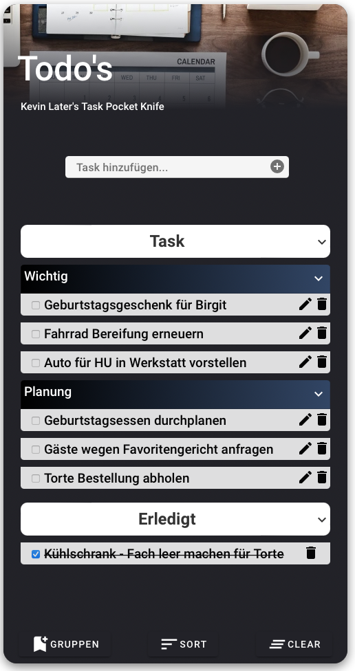

# List App (HTML- CSS- & JavaScript-Code)
Dieses Repository enthält den HTML- und JavaScript-Code für die List-App von Kevin Later, welche im Modul "Grundlagen der Programmierung" des Kurses "Mobile App Development" entwickelt wurde.  

